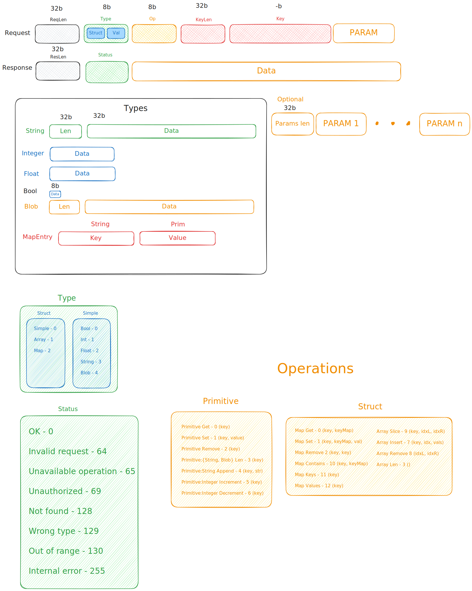

# Valkyrie


Dependency agnostic in-memory database with a focus on performance and strict typing.

## Features

- Saving data in RAM for quick access;
- Secure parallel access to the database;
- Minimizing dependence on third-party libraries;
- Client-server communication through a low-level TCP protocol for efficient
data exchange;
- A convenient [library](https://github.com/valkyriedb/valkyrie_sdk) for
interacting with the database.

## Running Valkyrie with Docker

### 1. Pull the Docker image

```bash
docker pull valkyriedb/valkyrie
```

### 2. Create `.env` file

An example of a `.env` file is stored in `.example.env`. Change the environment
variables according to your needs.

### 3. Run the container

Specify the `.env` file and port mapping:

```bash
docker run --env-file .env -p {PORT}:{PORT} valkyriedb/valkyrie
```

## API

To communicate with the DB, connect via TCP and follow this packet structure:


